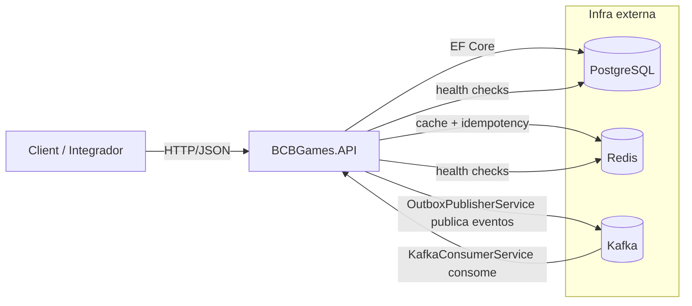
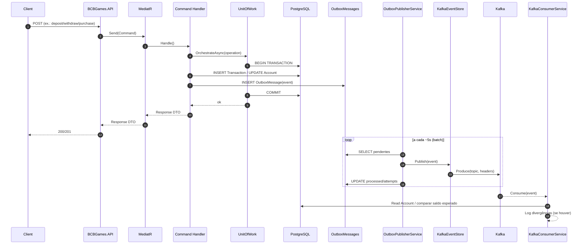

# Arquitetura (visão global)

Este documento descreve a arquitetura do projeto. Use o [Mermaid](https://mermaid.live/) para visualizar.

## Nível 1 — Contexto



## Nível 2 — Containers

```mermaid
flowchart TB
  subgraph API[BCBGames.API]
    Controllers[Controllers]
    Middleware[GlobalExceptionMiddleware]
  end

  subgraph APP[BCBGames.Application]
    MediatR[MediatR]
    Commands[Commands (Handlers)]
    Queries[Queries (Handlers)]
    Behaviors[Pipeline Behaviors (Logging)]
  end

  subgraph DOMAIN[BCBGames.Domain]
    Entities[Entities: Account, Transaction]
    Events[Domain Events]
    Interfaces[Interfaces: IUnitOfWork, Repos, IOutboxService, IEventStore, etc.]
    Exceptions[Domain Exceptions]
  end

  subgraph INFRA[BCBGames.Infrastructure]
    DI[DependencyInjection]
    Db[EF Core: AppDbContext]
    Repos[Repositories + UnitOfWork]
    Cache[RedisCacheService]
    Idem[IdempotencyService]
    Outbox[OutboxService]
    OutboxWorker[OutboxPublisherService (Hosted)]
    EventStore[KafkaEventStore (Producer)]
    Consumer[KafkaConsumerService (Hosted)]
    Lock[RedisDistributedLockService]
  end

  subgraph EXT[Dependências]
    Pg[(PostgreSQL)]
    Redis[(Redis)]
    Kafka[(Kafka)]
  end

  Controllers --> MediatR
  Middleware --> Controllers

  MediatR --> Behaviors
  MediatR --> Commands
  MediatR --> Queries

  Commands --> Entities
  Commands --> Events
  Commands --> Interfaces
  Queries --> Interfaces

  DI --> Db
  DI --> Repos
  DI --> Cache
  DI --> Idem
  DI --> Outbox
  DI --> OutboxWorker
  DI --> EventStore
  DI --> Consumer
  DI --> Lock

  Repos --> Db
  Cache --> Redis
  Idem --> Redis
  Lock --> Redis
  Db --> Pg

  Outbox --> Db
  OutboxWorker --> Db
  OutboxWorker --> EventStore
  EventStore --> Kafka
  Consumer --> Kafka
  Consumer --> Repos
```

## Nível 3 — Fluxo


